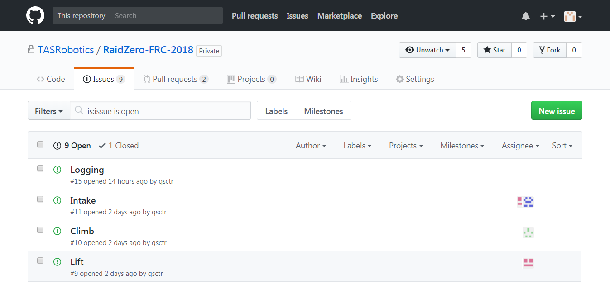
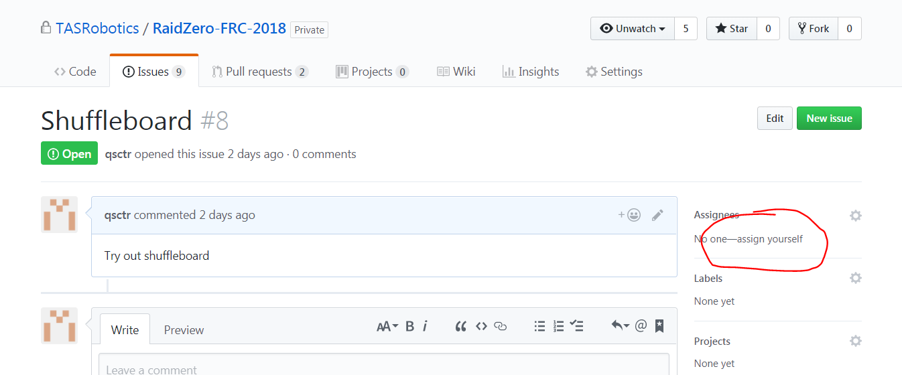

# Issues

[back](README.md)

We use Issues to keep track of things to do, or bugs in the program.

## Issues page

If you are looking for something to do, you can go to the issues page. It is in the `Issues` tab in the repository web interface.

There are two kinds of issues: open and closed. Open means that it hasn't been completed yet, or the bug hasn't been fixed yet. Closed means that it has been completed.

Each issue has an associated number, which is shown beside the issue name.

If you find an open issue that you want to work on, you can assign yourself to that issue, to let people know that you are working on it.

You can also comment on any issue, if you want to discuss something.

If you are not working on an issue but you want to follow along with what's happening, you can click the "subscribe" button on the right to get notifications when there are updates on the issue.

## Closing issues

When an issue has been completed, you should close it. You could close it manually in the issue page. Or, since issues are usually completed through pull requests, you could put in your pull request description keywords like "closes #8" or "fixes #16", where the number is the number of the issue you are closing. When the pull request is merged, the issue will be automatically closed.
