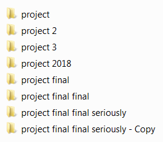

# Introduction

## Git

Git is a version control system (VCS). It tracks every change you make to your code, so you can easily revert to previous versions and avoid doing things like this.

## GitHub

GitHub is a platform that hosts git projects. You can think of it as cloud storage for your git projects. This allows multiple people to collaborate on the same project. In addition, it provides additional useful things such as issues and pull requests.

## Repository

In git terminology, a repository (repo for short) is a project. For example, the [RaidZero-FRC-2018 repository](https://github.com/TASRobotics/RaidZero-FRC-2018) is the project for 2018's competition code.

## Users and organizations

On GitHub, repositories can be owned by users or organizations. An organization is just a group of users. If you are reading this, you are probably in the `TASRobotics` organization.
