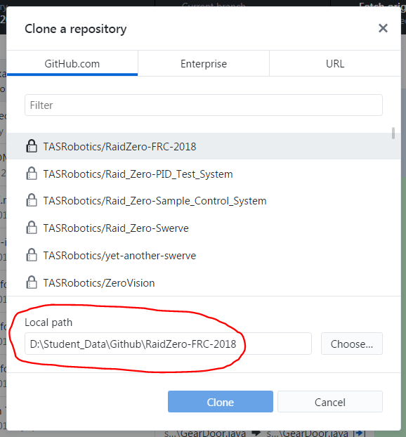

# Getting started

[back](README.md)

## GitHub web interface

Each repository has a web interface on github.com which can be accessed in your browser. The URL for each repo is github.com/`user or organization name`/`repo name`. For example the current page you are reading is in the guide repo, so the URL is github.com/TASRobotics/guide. Note that all TASRobotics repos are private, so you must be signed in to access them.

In the web interface, you can browse the files in the repository, as well as use issues and pull requests.

## Git client

In order to work on projects, you have to have git on your computer.

First, download and install git from [here](https://git-scm.com/downloads).

Then, you can either:
- use [GitHub Desktop](https://desktop.github.com) as a GUI for git. (recommended)
- use the integrated git UI inside Visual Studio Code.
- use git directly from the command line.

## Cloning

To make changes to a repo, you have to clone it (i.e. download it to your computer). In GitHub Desktop, go to `File > Clone repository`, then choose the repo you want to clone. **Pay attention to the "Local path" option:** make sure you know where it is cloning to.

## Opening in VSCode

In VSCode, go to `File > Open folder`, then select the folder you cloned it to.
