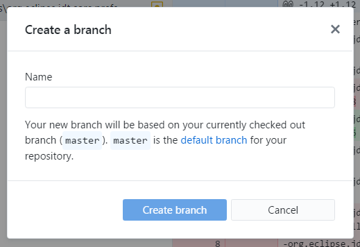
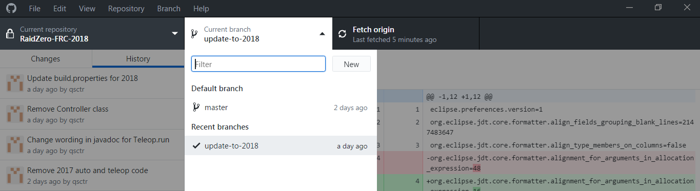
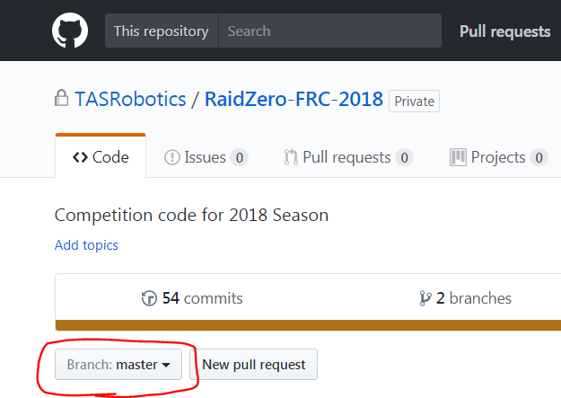

# Branches

Branches allow multiple people to work together on the same project. You can think of branches as different variants of the code that exist at the same time.

## Why do we need branches?

If we did everything on one branch, it would be very hard for multiple people to work on the code at the same time. There is no real-time syncing like Google Docs. Instead, git only syncs when you tell it to. Therefore, there would be conflicts when people edit the same files at the same time.

## The master branch

The main branch of the repository is called "master". You should not make changes directly to the master branch. Instead, you should create a new branch, make changes there, and merge that branch back into master.

## Creating a new branch

When you want to work on some task, you should create a new branch. The branch should only be for that task. Do not work on two separate and unrelated things on the same branch. If you do want to work on two separate and unrelated things, do them on two different branches.

When creating a new branch, you need to base it off of an existing branch. After your new branch is created, its contents will be identical to the branch you based it off of. Usually, you will be branching off of master.

To create a new branch in GitHub Desktop, go to `Branch > New Branch`. This will open a dialog asking you for the name of the new branch, and, if you are not currently on the master branch, what the base branch should be.

You can also create a new branch on the GitHub web interface.

After creating it, you will automatically be switched to the new branch.

## Naming branches

The name of a branch should describe what the branch is for.

The name should be all lowercase, with words separated by dashes.

## Switching branches

You shouldn't have to switch branches often.

To switch branches in GitHub Desktop, click on the current branch.

Note that this will change the actual files on your computer, so make sure you don't have any uncommitted changes before switching branches.

To switch which branch you are looking at when you are browsing the code in the web interface, you can use the branch dropdown. By default the branch is master.

## Updating from master

Sometimes you want to merge master into your branch. This would happen if:

1. You branch off master
2. Someone else merges another branch into master
3. You want the new changes in master to also be in your branch

To do this, go to `Branch > Update from master` in GitHub desktop.

## The network diagram

Having a lot of branches can get confusing. There is a nice graphical view of all the branches of a repository, which you can access by going to the `Insights` tab in the web interface, then selecting `Network`.
