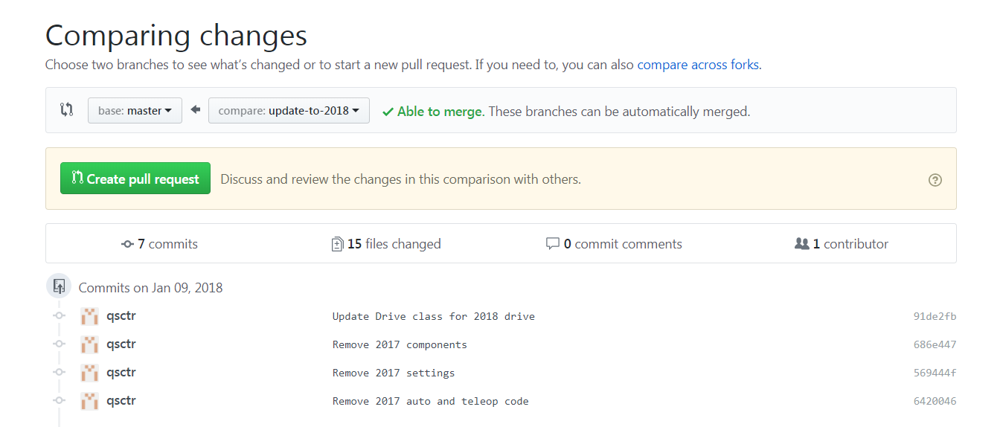
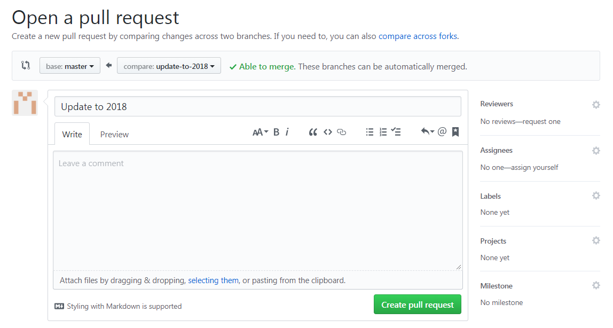

# Merging

[back](README.md)

When you are done making changes to your branch, you should merge it back into the master branch.

## Before you merge

Make sure that your code works, and that it has been tested thoroughly. The master branch should only contain stable, working code. Also, make sure that your code complies with the [style guide](https://github.com/TASRobotics/guide/blob/master/java-style-guide).

## Compare

The first step is to do a comparison of your branch with master, to see what you changed.

In GitHub Desktop, go to `Branch > Compare on GitHub`.

In the GitHub web interface, if you pushed to your branch recently, then you will see a message asking if you want to compare changes. If not, then switch to your branch, then click `Compare` on the right side.

After you have reviewed what you changed, create a pull request with the big green button.

## Pull Request

If you have stuff to say, then write it in the comment box.

If you want a specific person to review your code, then you can request them to be a reviewer on the right hand side. Otherwise don't request anyone.

Then, create the pull request. Now you just have to wait for someone to review the pull request.

There can be two outcomes from a pull request review: approved or changes requested. If it is approved then it can be merged. If changes were requested, then you have to make some changes and push to the branch again.
